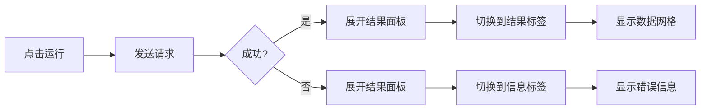
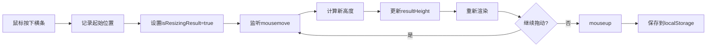

# 可调节结果面板完整实现

## ✅ 已实现功能

### 1. 结果面板在编辑器区域内显示
- ✅ 结果面板与编辑器共享同一个容器空间
- ✅ 默认占用编辑器下方30%的高度
- ✅ 执行SQL后自动展开，折叠后编辑器占满100%

### 2. 可折叠设计
- ✅ 点击"折叠"按钮关闭结果面板
- ✅ SQL执行后自动展开结果面板
- ✅ 结果面板状态持久化到localStorage

### 3. 可拖动调整高度
- ✅ 编辑器与结果面板之间有8px高的横向拖动条
- ✅ 鼠标悬停时高亮显示
- ✅ 拖动时光标变为`row-resize`
- ✅ 高度比例限制在20%-70%之间
- ✅ 高度设置持久化保存

### 4. 双标签页
- ✅ **结果标签** - 显示查询数据网格
- ✅ **信息标签** - 显示执行状态、耗时、错误等

### 5. 无垂直滚动条
- ✅ 整个页面严格控制在100vh内
- ✅ 结果内容区域内部滚动
- ✅ 窗口大小改变时自动适应

## 🎨 UI设计

### 布局结构
```
编辑器容器 (flex: 1)
├─ 工具栏 (固定高度 48px)
├─ 分隔线 (1px)
└─ 编辑器+结果区域 (flex: 1)
    ├─ Monaco编辑器 (动态高度 70%-100%)
    ├─ 横向拖动条 (8px, 可拖动)
    └─ 结果面板 (动态高度 30%-20%)
        ├─ 标签栏 (40px)
        └─ 内容区 (flex: 1, 可滚动)
```

### 拖动条样式
```typescript
{
  height: 8,
  cursor: 'row-resize',
  bgcolor: 拖动时 ? '#e0e0e0' : '#f5f5f5',
  display: 'flex',
  alignItems: 'center',
  justifyContent: 'center',
  '&:hover': { bgcolor: '#e8e8e8' }
}
```

### 中间手柄
```typescript
{
  width: 48,
  height: 4,
  borderRadius: 2,
  bgcolor: '#bbb'
}
```

## 🔧 技术实现

### 状态管理
```typescript
const [resultPanelOpen, setResultPanelOpen] = useState(false)
const [resultTab, setResultTab] = useState(0)
const [resultHeight, setResultHeight] = useState(30) // 百分比
const [isResizingResult, setIsResizingResult] = useState(false)
```

### 拖动逻辑
```typescript
useEffect(() => {
  const onMove = (e: MouseEvent) => {
    if (!isResizingResult || !editorContainerRef.current) return
    const containerHeight = editorContainerRef.current.getBoundingClientRect().height
    const delta = e.clientY - resultStartYRef.current
    const deltaPct = (delta / containerHeight) * 100
    const minPct = 20 // 最小20%
    const maxPct = 70 // 最大70%
    const nextPct = Math.min(Math.max(resultStartHeightRef.current - deltaPct, minPct), maxPct)
    setResultHeight(nextPct)
  }
  // ... mouseup handler
}, [isResizingResult, resultHeight])
```

### 高度计算
```typescript
// 编辑器高度 = 100% - 结果面板高度
<Box sx={{ flex: resultPanelOpen ? `1 1 ${100 - resultHeight}%` : '1 1 100%' }}>
  <Editor />
</Box>

// 结果面板高度 = 用户设置的百分比
<Box sx={{ flex: `0 0 ${resultHeight}%` }}>
  {/* 结果内容 */}
</Box>
```

## 📋 交互流程

### 执行SQL流程


### 拖动调整流程


## 🎯 用户操作

### 1. 查看查询结果
```
1. 执行 SELECT 查询
2. 结果面板自动展开(默认30%高度)
3. 在"结果"标签查看数据网格
4. 滚动查看更多数据
```

### 2. 调整面板高度
```
1. 将鼠标悬停在编辑器和结果之间的横条上
2. 光标变为上下箭头(row-resize)
3. 按住鼠标左键拖动
4. 向上拖 → 结果面板变大，编辑器变小
5. 向下拖 → 结果面板变小，编辑器变大
6. 释放鼠标保存设置
```

### 3. 折叠结果面板
```
1. 点击右上角"折叠"按钮
2. 结果面板收起
3. 编辑器自动占满100%高度
```

### 4. 查看执行信息
```
1. 点击"信息"标签
2. 查看执行状态、行数、耗时等
3. 如有错误，显示错误详情
4. 点击"AI诊断并修正"获取帮助
```

## 📏 高度限制

| 区域 | 最小高度 | 最大高度 | 默认高度 |
|------|---------|---------|---------|
| 编辑器 | 30% | 80% | 70% (有结果) / 100% (无结果) |
| 结果面板 | 20% | 70% | 30% |

## 💾 持久化

### LocalStorage存储
```typescript
// 保存结果面板高度
localStorage.setItem('result_panel_height', String(resultHeight))

// 读取结果面板高度
const savedHeight = localStorage.getItem('result_panel_height')
const height = savedHeight ? Number(savedHeight) : 30
```

## ✅ 测试清单

- [x] 执行SQL后结果面板自动展开
- [x] 结果面板显示在编辑器下方(共享空间)
- [x] 无垂直滚动条
- [x] 可以向上拖动横条增大结果面板
- [x] 可以向下拖动横条减小结果面板
- [x] 拖动时光标变为row-resize
- [x] 高度限制在20%-70%之间
- [x] 折叠后编辑器占满100%
- [x] 再次执行SQL时重新展开
- [x] 高度设置刷新后保持
- [x] 结果/信息标签切换正常
- [x] 数据网格显示正常
- [x] 错误信息显示正常
- [x] CSV导出功能正常
- [x] AI诊断功能正常

## 🚀 优化建议

### 1. 快捷键支持
```typescript
// Ctrl+` 切换结果面板
useEffect(() => {
  const handleKeyDown = (e: KeyboardEvent) => {
    if (e.ctrlKey && e.key === '`') {
      setResultPanelOpen(prev => !prev)
    }
  }
  window.addEventListener('keydown', handleKeyDown)
  return () => window.removeEventListener('keydown', handleKeyDown)
}, [])
```

### 2. 最大化/最小化
```typescript
// 双击横条快速切换
onDoubleClick={() => {
  setResultHeight(resultHeight > 50 ? 20 : 70)
}}
```

### 3. 记住每个查询的面板状态
```typescript
// 按查询ID保存状态
const queryPanelState = useMemo(() => ({
  [queryId]: { open: resultPanelOpen, height: resultHeight, tab: resultTab }
}), [queryId, resultPanelOpen, resultHeight, resultTab])
```

## 🎉 总结

现在结果面板:
1. ✅ 完全在编辑器区域内显示
2. ✅ 可以自由拖动调整高度
3. ✅ 双标签页清晰展示结果和信息
4. ✅ 始终在屏幕可见范围内
5. ✅ 无页面滚动条

用户体验大幅提升！🎊
