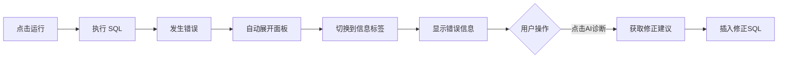

# 结果面板改进说明

## ✨ 新功能特性

### 1. 可折叠结果面板
- ✅ 结果面板默认折叠，不占用编辑器空间
- ✅ SQL 执行后自动展开，占据编辑器下方 30% 区域
- ✅ 用户可手动点击"折叠"按钮关闭面板
- ✅ 结果始终在屏幕可见范围内

### 2. 双标签页设计

#### 📊 标签页 1: 结果
- 以网格表格形式展示查询结果
- 斑马纹行样式，提升可读性
- 列标题带背景色突出显示
- 支持 CSV 导出功能

#### 📋 标签页 2: 信息
显示详细的执行信息：
- **状态**: 成功/失败（带颜色标识）
- **返回行数**: SELECT 查询的结果数量
- **影响行数**: INSERT/UPDATE/DELETE 的影响行数
- **执行耗时**: SQL 执行时间
- **错误信息**: 格式化的错误提示
- **AI 诊断**: 一键调用 AI 诊断并修正 SQL

## 🎨 UI 改进

### 表格样式优化
```
- 表头：灰色背景 (#f9f9f9)，粗体字
- 边框：2px 底部边框分隔表头
- 行样式：斑马纹（白色/浅灰交替）
- 字体：统一使用 0.875rem 小字号
- 间距：合理的 padding 提升可读性
```

### 错误信息展示
```
- 红色背景框 (#fff3f3)
- 红色边框 (#ffcdd2)
- 等宽字体 (monospace)
- 保留原始格式 (pre-wrap)
- 醒目的 AI 诊断按钮
```

## 🔄 交互流程

### 执行成功流程


### 执行失败流程


## 💡 用户操作指南

### 1. 查看查询结果
```
1. 执行 SELECT 查询
2. 面板自动展开，默认显示"结果"标签
3. 在表格中浏览数据
4. 可点击"导出 CSV"下载结果
```

### 2. 查看执行信息
```
1. 执行任何 SQL
2. 点击"信息"标签
3. 查看详细的执行统计和状态
```

### 3. 处理 SQL 错误
```
1. 执行出错的 SQL
2. 面板自动展开并切换到"信息"标签
3. 查看格式化的错误信息
4. 点击"🤖 AI诊断并修正"按钮
5. AI 自动分析并插入修正后的 SQL
```

### 4. 折叠/展开面板
```
- 点击右上角"折叠"按钮 → 收起面板
- 再次执行 SQL → 自动展开
```

## 📐 布局说明

### 屏幕分配
```
+----------------------------------+
|         顶部导航栏 (固定)          |
+----------------------------------+
|                                  |
|        编辑器区域 (70%)           |
|                                  |
+----------------------------------+
|   结果面板 (30% - 可折叠)         |
|   [结果] [信息]   [导出] [折叠]   |
|   +----------------------------+  |
|   |        内容区域             |  |
|   +----------------------------+  |
+----------------------------------+
```

### 动态高度
- 面板折叠时：编辑器占 100%
- 面板展开时：编辑器 70% + 面板 30%

## 🎯 代码关键点

### 状态管理
```typescript
const [resultPanelOpen, setResultPanelOpen] = useState(false)
const [resultTab, setResultTab] = useState(0) // 0: 结果, 1: 信息
```

### 自动展开逻辑
```typescript
const execMutation = useMutation({
  mutationFn: async (payload: any) => {
    try {
      const { data } = await api.post('/api/sql/execute', payload)
      setResultPanelOpen(true)  // 展开面板
      setResultTab(0)            // 切换到结果标签
      return data
    } catch (e: any) {
      setResultPanelOpen(true)  // 展开面板
      setResultTab(1)            // 切换到信息标签（显示错误）
      return { success: false, error: title }
    }
  }
})
```

### 动态高度计算
```typescript
<Box sx={{ flex: resultPanelOpen ? '0 0 70%' : '1 1 auto' }}>
  <Editor ... />
</Box>

{resultPanelOpen && (
  <Box sx={{ flex: '0 0 30%', ... }}>
    {/* 结果面板 */}
  </Box>
)}
```

## ✅ 测试清单

- [x] 执行 SELECT 查询，面板自动展开显示结果
- [x] 执行 INSERT/UPDATE，面板显示影响行数
- [x] 执行错误 SQL，面板自动切换到信息标签
- [x] 点击折叠按钮，面板收起
- [x] 再次执行 SQL，面板重新展开
- [x] 在结果和信息标签间切换
- [x] 导出 CSV 功能正常
- [x] AI 诊断按钮正常工作
- [x] 结果面板不超出屏幕范围
- [x] 表格样式美观易读

## 🚀 后续优化建议

1. **可调节面板高度**
   - 添加拖动手柄，允许用户自定义面板高度
   - 记住用户偏好设置

2. **结果分页**
   - 当结果集过大时，分页显示
   - 虚拟滚动优化性能

3. **列排序和筛选**
   - 点击列标题排序
   - 添加列筛选功能

4. **导出格式扩展**
   - 支持 JSON、Excel 格式导出
   - 可选择导出全部或选中行

5. **历史记录**
   - 保存最近执行的查询和结果
   - 快速切换查看历史结果

现在结果面板完美地固定在编辑器下方，不会跑出屏幕外了！🎉
